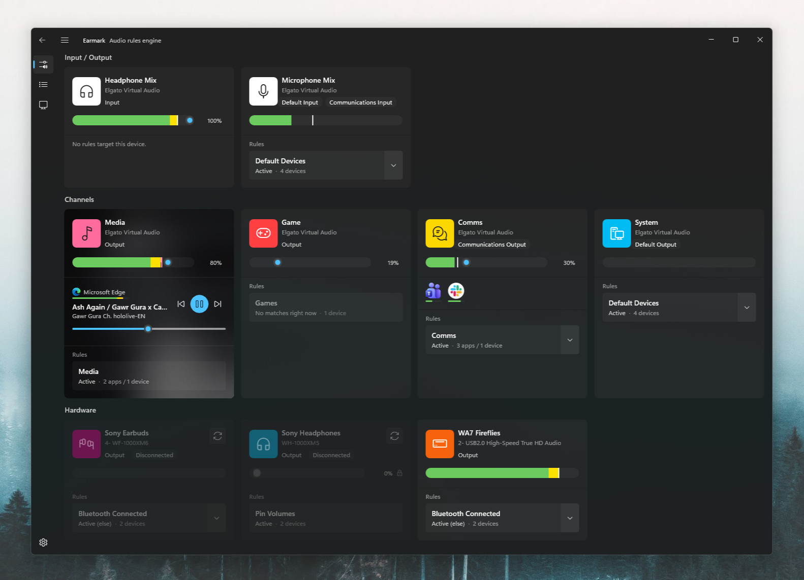
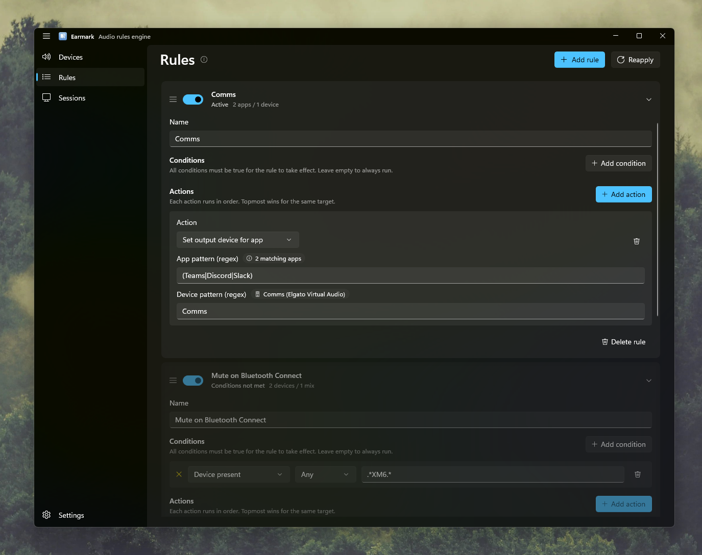
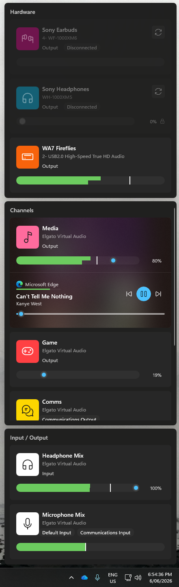

# Earmark

An audio companion for Windows, built around a regex-driven rules engine. Routing rules pin each app to the device you want (a browser to your media DAC, Discord onto your headset mic, the system default to a specific endpoint) and keep it there across reboots, app updates, and driver reinstalls. Around that sits a live per-device mixer, now-playing with media controls, and quick access from the tray or a global shortcut. Like Volume Mixer's per-app device picker, but pattern-driven and persistent. A full control centre.

[](https://github.com/hoobio/earmark/releases/latest)

[](LICENSE)
[](https://github.com/hoobio/earmark/stargazers)
[](https://github.com/hoobio/earmark/issues)
[](https://github.com/hoobio/earmark/commits/main)

  

## Features

### Routing rules

- **Rule-based routing**: each rule is a list of conditions (all must hold) and a list of actions (all run in order, topmost wins per target).
- **Four action types**: pin an app's render endpoint, pin an app's capture endpoint, set the system default output, set the system default input. Default actions can target the "default" role, the "communications" role, or both.
- **Conditions**: `Device present` and `Device missing`, scoped to render, capture, or any flow. The same regex syntax as device patterns.
- **Regex pattern matching**: `AppPattern` is tested against both process name and full executable path; `DevicePattern` against the device's friendly and display names.
- **Live status**: rules dim when off, when shadowed by an earlier rule, or when their conditions are not met. Match counts and resolved devices appear inline as you edit.
- **Drag to reorder**: rules apply top-down, so reordering changes precedence.
- **Auto-reapply**: routing reapplies on rule changes, on device add/remove, on default-device changes, and on a 10-second safety tick.

### Devices dashboard

- **Live mixer**: a card per endpoint with a volume slider, mute, and per-channel peak meters. Disconnected devices stay listed with their settings remembered, and reactivate when they reconnect.
- **App indicators**: chips show which apps are on each device, flagging closed and elevated processes; jump straight to a rule with "Open in Rules".
- **Quick pin**: route a running app to a device from its card without writing a rule.
- **Bluetooth**: connect or disconnect Bluetooth audio devices from the card.
- **Customisable**: tune card height, dividers, rule visibility, app indicators, and meters globally or per device; hide audio forwarders, always show pinned apps, or keep stopped apps visible.

### Now playing & media

- **Now playing**: each card surfaces the active media session (title, artist, artwork) with transport controls and a seek bar. Titles and artists are tidied (drops `- Topic`, "Official ..." tags, and redundant artist prefixes).
- **Taskbar controls**: thumbnail play/pause/skip buttons and a playback badge on the taskbar icon (auto-hides after a pause).
- **Quick Controls**: a configurable global shortcut opens a compact window to glance at devices and control playback without opening the main window.

### App

- **Wave Link**: optional integration that surfaces Elgato Wave Link channels.
- **Tray-friendly**: launch hidden, close to tray, single-instance.
- **Stays current**: the standalone build checks GitHub for new releases and shows an "Update available" badge in the title bar (toggle it off in Settings). Version, logs, and one-click bug/feature links live in Settings > About.

## Prerequisites

- **Windows 10 (19041+)** or **Windows 11** (Win11 22000+ enables the modern audio policy interface).

No external CLIs, no service install, no admin rights.

## Installation

### GitHub Releases

1. Download the latest `.msi` for your architecture (x64 or ARM64) from [Releases](https://github.com/hoobio/earmark/releases/latest).
2. Run the installer.
3. Launch Earmark from the Start menu.

### From Source

```powershell
git clone https://github.com/hoobio/earmark.git
cd earmark
dotnet build src/Earmark.App/Earmark.App.csproj -c Debug -p:Platform=x64
.\src\Earmark.App\bin\x64\Debug\net10.0-windows10.0.26100.0\win-x64\Earmark.App.exe
```

See [CONTRIBUTING.md](CONTRIBUTING.md) for the full inner-loop pattern (the app holds open file handles on its own DLLs, so you must kill before rebuilding).

## Usage

1. Click **Add rule**.
2. Pick an action type (e.g. *Set output device for app*).
3. Fill in the regex patterns. Live match counts appear next to the field labels.
4. Optionally add conditions, e.g. *Device present `Headphones`*, so the rule only fires when your headset is plugged in.
5. Drag rules to reorder. Topmost matching rule wins per target.
6. Toggle the switch on the card header to disable a rule without deleting it.

### Example: route Discord and Teams to your headset, browsers to your DAC

Two rules, top to bottom:

| Name | Action | App pattern | Device pattern |
|------|--------|-------------|----------------|
| Comms | App output | `(Teams\|Discord\|Slack)` | `Comms` |
| Browsers | App output | `(chrome\|edge\|firefox\|brave)` | `Media` |

### Example: only pin the system default to your speakers when your DAC is connected

A single rule with one condition and one action:

- **Condition**: *Device present, Render, `USB DAC`*
- **Action**: *Set system default output, `USB DAC`* (default + comms both on)

When the DAC is unplugged, the condition fails, the rule dims, and Windows reverts to its own selection.

## Where state lives

| What | Where |
|------|-------|
| Rules | `%AppData%\Hoobi\Earmark\rules.json` |
| Settings | `%AppData%\Hoobi\Earmark\settings.json` |
| Logs | `%LocalAppData%\Earmark\logs\earmark-{yyyyMMdd-HHmmss}.log` (one per launch) |

Rules and settings live in roaming `%AppData%`. Dev and pre-release builds nest under a channel subfolder so they never clobber a stable install.

## How it works

Earmark uses two distinct Windows audio APIs depending on the rule type:

- **Per-app routing** uses `IAudioPolicyConfigFactory`, an undocumented WinRT interface activated against the `Windows.Media.Internal.AudioPolicyConfig` runtime class. This is the same mechanism Windows itself uses for the per-app device picker in Volume Mixer.
- **System default device** uses the older `IPolicyConfigVista::SetDefaultEndpoint` on `CPolicyConfigClient`.

Both interfaces are wrapped via raw COM interop because modern .NET no longer marshals `IInspectable`-based WinRT interfaces declaratively. See [src/Earmark.Audio/Interop/](src/Earmark.Audio/Interop/) for the implementation.

A rule matcher walks rules top-down. For each rule it checks conditions, then iterates actions in order. The first action whose target matches a session (for app actions) or role (for default actions) wins. A rule evaluator runs the same logic for the UI to compute live status (active, idle, shadowed, conditions-not-met) and dim cards.

## Architecture

```
src/
  Earmark.Core/               # Models, rule matcher/evaluator, JSON persistence (no Windows deps in interfaces)
  Earmark.Audio/              # COM interop + NAudio session/endpoint services
  Earmark.App/                # WinUI 3 UI, hosting, settings, tray, single-instance
tests/
  Earmark.Core.Tests/         # xUnit (scaffolding)
```

## Building

```powershell
# Debug
dotnet build src/Earmark.App/Earmark.App.csproj -c Debug -p:Platform=x64

# Release
dotnet publish src/Earmark.App/Earmark.App.csproj -c Release -p:Platform=x64
```

The csproj declares `<Platforms>x64;ARM64</Platforms>` only - `AnyCPU` is not configured, so always pass `-p:Platform=x64` (or `ARM64`).

## Contributing

Bug reports, feature requests, and PRs are all welcome. Start with [CONTRIBUTING.md](CONTRIBUTING.md).

## License

[MIT](LICENSE)
